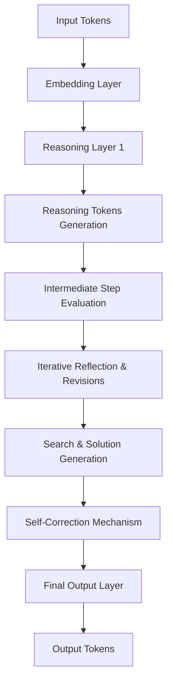

```mermaid
graph TD
  A[Input Tokens] --> B[Embedding Layer]
  B --> C[Reasoning Layer 1]
  C --> D[Reasoning Tokens Generation]
  D --> E[Intermediate Step Evaluation]
  E --> F[Iterative Reflection & Revisions]
  F --> G[Search & Solution Generation]
  G --> H[Self-Correction Mechanism]
  H --> I[Final Output Layer]
  I --> J[Output Tokens]

```